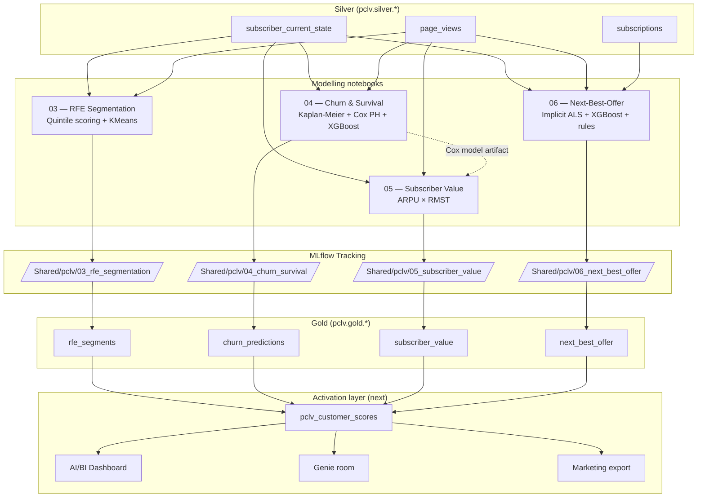

# Subscription pCLV Demo — Modelling Reference

**Platform:** Databricks (Notebooks + MLflow + Unity Catalog)
**Status:** All four gold tables produced. Ready to join into `pclv_customer_scores`.

This document is the single-source-of-truth for the modelling half of the demo.
It sits alongside `data_ingestion.md` (bronze + silver) and covers what
happens once silver is populated.

---

## 1. Where this fits in the project

```
Silver (pclv.silver.*)                        [covered in data_ingestion.md]
        │
        ▼
Four modelling notebooks   ◄── this document
        │
        ▼
Gold (pclv.gold.*)          ◄── this document
        │
        ▼
pclv_customer_scores + Dashboard + Genie     [next step]
```

The four notebooks answer the four questions of the Google "Predicting LTV" framework,
adapted for a contractual (subscription) business:

| Question | Notebook | Gold output |
|---|---|---|
| **Who** to target | `03_rfe_segmentation.py` | `pclv.gold.rfe_segments` |
| **When** they'll churn | `04_churn_survival.py` | `pclv.gold.churn_predictions` |
| **How much** they'll be worth | `05_subscriber_value.py` | `pclv.gold.subscriber_value` |
| **What** to offer them next | `06_next_best_offer.py` | `pclv.gold.next_best_offer` |

---

## 2. Architecture



**Cross-notebook dependency:** Notebook 05 pulls the pickled Cox PH model from
notebook 04's most recent successful MLflow run. This is why 04 must run before 05.
All other notebooks are independent and can run in any order.

---

## 3. Notebook-by-notebook

### 3.1 `03_rfe_segmentation.py` — Who to target

**Inputs:** `pclv.silver.subscriber_current_state`, `pclv.silver.page_views`

**Method:**
1. Restrict to active subscribers (churned users need a separate winback model)
2. Aggregate the last 90 days of page views per user:
   - Recency = days since last read
   - Frequency = distinct active days
   - Engagement = `log1p(reads_per_week) × section_breadth × log1p(mean_read_time)`
3. Quintile-score each dimension 1-5 (Recency reversed so lower days = higher score)
4. Sum to a single `rfe_score` (3-15) and map to human-readable labels
5. In parallel, fit StandardScaler + KMeans (k=5) on the raw features to validate that
   the label buckets reflect real behavioural structure

**Segment labels:** Champions, Loyal, New / Reactivated, At Risk, Cooling Off,
Hibernating, Regular

**MLflow logged:** silhouette (sampled), inertia, per-segment sizes, KMeans model, scaler

**Output — `pclv.gold.rfe_segments`:** one row per active user

| Column | Meaning |
|---|---|
| `user_id` | PK |
| `recency_days`, `active_days_90d`, `views_90d`, `mean_read_time`, `section_breadth`, `engagement_score` | Raw features |
| `r_score`, `f_score`, `e_score` | Quintile scores 1-5 |
| `rfe_score` | Sum, 3-15 |
| `segment_label` | Human-readable bucket |
| `kmeans_cluster` | Data-driven cluster 0-4 |
| `scored_at` | Reference date |

---

### 3.2 `04_churn_survival.py` — When they'll churn

**Inputs:** `pclv.silver.subscriber_current_state`, `pclv.silver.page_views`

**Method — three complementary models:**

1. **Kaplan-Meier baseline** — non-parametric survival curves per plan, plus population
   median. Used as sanity check and dashboard input.
2. **Cox Proportional Hazards** (lifelines, penalizer=0.01) on tenure + engagement +
   plan + acquisition_channel + country + signup_cohort. Produces interpretable hazard
   ratios and a survival function usable at any horizon. **This model is the input to
   notebook 05.**
3. **XGBoost 90-day churn classifier** on the same feature set. Non-linear
   discrimination; complements Cox where the proportional-hazards assumption is weak.

**Key design choices:**
- Engagement features are computed over the 60 days *before* `min(cancel_date, reference_date)`
  to avoid leakage from post-cancel views (uses `is_post_cancel_view` from silver)
- Right-censoring is directly observed via `is_censored` from silver — no inference needed
- Cox model is pickled and logged as an MLflow artifact so notebook 05 can reload it

**MLflow logged:** KM plot, median survival, Cox C-index (train + test), Cox coefficient
summary, XGB AUC / PR-AUC / Brier score, XGB feature importance, both models

**Output — `pclv.gold.churn_predictions`:** one row per active user

| Column | Meaning |
|---|---|
| `user_id` | PK |
| `cox_partial_hazard` | Relative hazard vs Cox baseline |
| `cox_survival_90d` | P(alive at current tenure + 90 days) |
| `xgb_churn_prob_90d` | XGBoost 90-day churn probability |
| `scored_at` | Reference date |

---

### 3.3 `05_subscriber_value.py` — How much they're worth

**Inputs:** `pclv.silver.subscriber_current_state`, `pclv.silver.page_views`,
+ Cox PH model from notebook 04's MLflow run

**Method:**
1. Pull the pickled Cox model from the most recent `cox_ph` run in
   `/Shared/pclv/04_churn_survival`
2. For each active subscriber, predict the survival curve S(t) on a 50-point grid
   spanning 0-720 days
3. Compute **Restricted Mean Survival Time (RMST)** conditional on current tenure:
   ```
   RMST(τ) = ∫₀^τ S(tenure + t) / S(tenure) dt
   ```
   Trapezoidal integration.
4. Map `current_plan` to monthly CHF price (free=0, digital=29, premium=49, print=65)
5. Expected value = `arpu_monthly × rmst_months`

**Why RMST and not…**
- `ARPU × 1/hazard` → assumes constant hazard (exponential lifetimes). Wrong: real
  subscription hazard is highest early (onboarding drop-off) and drops later.
- `ARPU × median_lifetime` → throws away the tail of the survival distribution and is
  undefined when the median isn't reached.
- RMST is bounded, well-defined for any horizon, and does not require a parametric
  lifetime assumption.

**Horizon:** 24 months. Matches the marketing planning window; avoids extrapolating
past observed follow-up.

**MLflow logged:** horizon, integration method, mean / p50 / p90 expected value, ref
to the Cox run used

**Output — `pclv.gold.subscriber_value`:** one row per active user

| Column | Meaning |
|---|---|
| `user_id` | PK |
| `current_plan` | Current plan |
| `arpu_monthly` | Monthly CHF revenue from this user |
| `rmst_months` | Expected additional months alive over the horizon |
| `expected_value_chf` | `arpu_monthly × rmst_months` |
| `horizon_months` | 24 |
| `scored_at` | Reference date |

---

### 3.4 `06_next_best_offer.py` — What to offer next

**Inputs:** `pclv.silver.subscriber_current_state`, `pclv.silver.page_views`,
`pclv.silver.subscriptions`

**Method — two models combined by a decision rule:**

1. **Implicit ALS collaborative filtering** on the user × section matrix:
   - Weight = `log1p(sum(read_time_seconds))` per user × section
   - Hu-Koren-Volinsky confidence formulation: `c_ui = 1 + α·log(1+r_ui)` with α=15
   - 32 latent factors, 20 iterations, regularization=0.05
   - Post-cancel views excluded
   - Evaluated with precision@k on a random 80/20 holdout of interactions
   - Outputs the top *unread* section per user
2. **XGBoost upgrade-propensity classifier**:
   - Label = user has any `event_type = "upgrade"` in the subscription log
   - Features = tenure + engagement aggregates + current plan + demographics
   - Class-imbalance-weighted; early-stopping-tuned
3. **Decision rule** combines them per user:

| Situation | Recommended action |
|---|---|
| Free tier | `convert_to_digital` |
| Paid, upgrade_prob ≥ 0.4, not top plan | `upgrade_to_<next_plan>` |
| Paid, upgrade_prob < 0.1 | `reengagement_newsletter` |
| Paid, everything else | `cross_sell_folio_or_podcast` |

Every action carries the top ALS-recommended section as the content angle.

**MLflow logged:** ALS hyperparameters, precision@k, XGB upgrade AUC / PR-AUC, both
models

**Output — `pclv.gold.next_best_offer`:** one row per active user

| Column | Meaning |
|---|---|
| `user_id` | PK |
| `current_plan` | Current plan |
| `recommended_action` | One of the 4 action strings above |
| `recommended_content_section` | Top-1 ALS section |
| `upgrade_propensity` | XGBoost probability of upgrade |
| `als_score` | Raw ALS relevance score |
| `confidence_score` | Blended: `0.5·upgrade_prop + 0.5·normalised_als` |
| `scored_at` | Reference date |

---

## 4. How this differs from Retailer's project

The interview strategy is *one framework, two implementations*. Same four questions,
same MLflow-tracked lifecycle, but the model families change because the business
context changes from **transactional retail** to **contractual subscription**.

### 4.1 Component-by-component

| Question | Retailer (transactional) | Publisher (subscription) | Why the change |
|---|---|---|---|
| **Who** | RFM (Recency, Frequency, **Monetary**) | RFE (Recency, Frequency, **Engagement**) | Monetary is pinned by plan price → carries no segmentation signal. Engagement is the leading indicator of both churn and upgrade. |
| **When** | MBG/NBD "Buy-Til-You-Die" — infers latent `P(alive)` from purchase gaps | Kaplan-Meier + Cox PH + XGBoost — `is_censored` directly observed from the event log | MBG/NBD is designed for non-contractual settings where liveness is unobserved. Publisher's subscription log makes the cancel event a hard fact, so survival analysis is the correct family. |
| **How much** | Gamma-Gamma — expected AOV × predicted purchases | ARPU × RMST | AOV varies per transaction in retail; in subscriptions the plan pins revenue. Predicted *tenure* (RMST from Cox) is the uncertain quantity, not price. |
| **What** | Wide & Deep neural recommender (TensorFlow, Microsoft `reco_utils`) on CTNs (product codes) with `mag_code` item features | Implicit ALS on user × section + XGBoost upgrade propensity + rule engine | Retailer's catalogue is ~thousands of SKUs → deep architecture pays off. Publisher has ~15 sections and 4 plans → ALS is sufficient and faster. The primary "product" to recommend is a *plan action*, not content. |

### 4.2 The conceptual mapping worth memorising

The interview headline: *the four questions stay the same; the tools change because
the data-generating process changes.*

```
                Retailer                     Publisher
                (non-contractual)           (contractual)

Who ──────────► RFM ─────────────────────► RFE
                                            (Monetary drops out; Engagement matters more)

When ─────────► MBG/NBD ─────────────────► Cox PH + XGBoost + KM
                P(alive) inferred          is_censored observed;
                                           survival modelled directly

How much ─────► Gamma-Gamma ─────────────► ARPU × RMST
                expected AOV               fixed plan price × predicted tenure

What ─────────► Wide & Deep on CTNs ─────► ALS on sections + XGBoost + rules
                (many SKUs, deep model)    (few items, action decision)
```

### 4.3 What stays the same

- **The four-question decomposition** (who / when / how much / what)
- **MLflow-tracked full lifecycle** for every model
- **Cross-model composition** — one model's output feeds another (Cox → RMST in Publisher,
  mirroring MBG/NBD → Gamma-Gamma in Retailer)
- **Activation pattern** — score everyone into a wide gold table, then push to
  marketing channels for uplift measurement against a control group
- **Defensibility as a first-class design criterion** — every choice logged with
  rationale, not just results

### 4.4 The single most important conceptual point

MBG/NBD's `P(alive)` and Publisher's `subscriber_current_state.is_active` play the *same
conceptual role* — "is this customer still with us right now?" — but with a decisive
difference:

- In Retailer: unobserved, must be **inferred statistically** from purchase gaps
- In Publisher: **directly observed** in the contract log

Similarly, `is_censored` in Publisher is the direct answer to the right-censoring problem
that Fader-Hardie's BTYD papers spend chapters solving via latent-variable models.
The contract log makes it a lookup, not an inference.

This is the mapping the Data Lead will most likely probe. Being fluent in it demonstrates that
the framework was *understood*, not just *executed*.

---

## 5. Reproduction

1. Run the bronze pipeline (see `data_ingestion.md`)
2. Run the silver pipeline
3. Run notebooks in order:
   - `03_rfe_segmentation.py` (independent)
   - `04_churn_survival.py` (independent — must precede 05)
   - `05_subscriber_value.py` (depends on the pickled Cox model from 04's MLflow)
   - `06_next_best_offer.py` (independent)
4. Verify gold tables exist:
   ```sql
   SHOW TABLES IN pclv.gold;
   ```

All notebooks are idempotent — safe to re-run; each overwrites its own gold table.

---

## 6. Known simplifications

- **Plan prices are hardcoded** in notebook 05. Production would join a Unity Catalog
  reference table with `effective_from` / `effective_to` for price history.
- **XGBoost 90-day churn label** uses observed cancels within 730 days as a proxy;
  a production version would use a fixed-window survival label per prediction date.
- **ALS runs on section, not article** — cardinality on articles (~2000) is workable
  but section (~15) gives more stable factor decomposition on the synthetic data
  volume. Production would likely mix both signals.
- **RMST integration grid is fixed at 50 points** over 720 days. Adequate for a Cox
  model with smooth survival function; would refine for spline-based hazard models.
- **Decision rule in notebook 06 uses hardcoded thresholds** (0.4, 0.1). Production
  would calibrate these against uplift measurement from prior campaigns.

---

## 7. Anticipated technical probing (the Data Lead)

| Question | Where the answer lives |
|---|---|
| "Why survival analysis and not MBG/NBD?" | §4.4 — MBG/NBD infers what Publisher directly observes |
| "How do you handle right-censoring?" | Directly in `is_censored` from silver + Cox handles it natively |
| "Why Cox and XGBoost — pick one" | Cox for interpretability + survival function (needed for RMST); XGB for discrimination. They're complementary, not redundant. |
| "How do you avoid leakage in the engagement features?" | Window ends at `min(cancel_date, reference_date)`; uses silver's `is_post_cancel_view` flag |
| "Why RMST and not `ARPU / hazard`?" | §3.3 — constant-hazard assumption is wrong for subscriptions |
| "Why ALS and not Wide & Deep?" | §4.1 — 15 items, small model is sufficient; the interesting decision is plan action, not content ranking |
| "How would you handle plan-changers (upgrade / downgrade)?" | Cox with time-varying covariates or competing-risks model; MVP treats upgrade as a separate propensity task |
| "How would you productionise on Vertex AI?" | Delta → BigQuery, MLflow → Vertex AI Model Registry, Jobs → Vertex AI Pipelines, Dashboard → Looker, Genie → Vertex AI Search + Gemini |
| "Monitoring post-launch?" | Feature drift (KS on engagement features), prediction drift (population score distribution), calibration (Brier over time), plus segment-level uplift vs holdout |

---

## 8. Next steps

- [ ] `07_pclv_customer_scores.py` — join all four gold tables on `user_id` into a
      single wide activation view
- [ ] AI/BI Dashboard on `pclv_customer_scores` for the marketing team
- [ ] Genie room over `pclv.silver.*` + `pclv.gold.*` for stakeholder self-serve
- [ ] Architecture diagram export for the presentation slides
- [ ] Rehearse Retailer's → Publisher mapping story (§4.2)
